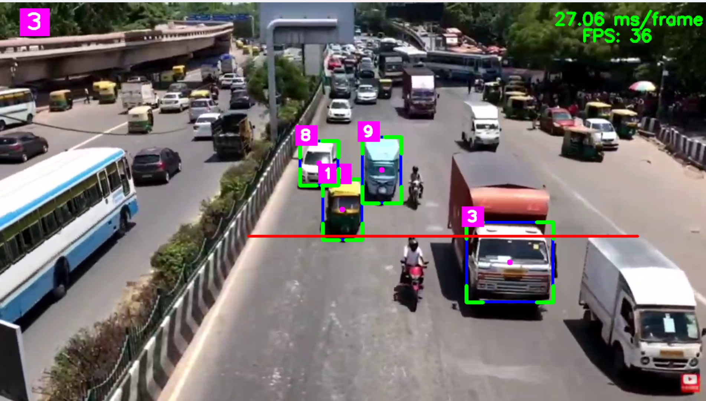

# Real-Time Vehicle Counting using YOLOv8 and SORT
## Demo

## Overview

This project performs real-time vehicle detection, tracking, and counting from traffic videos using YOLOv8 and the SORT tracking algorithm.

Vehicles are detected using YOLOv8, assigned unique IDs using SORT, and counted when crossing a predefined virtual line.

## Features

* Real-time vehicle detection
* Multi-object tracking with SORT
* Vehicle counting using virtual line crossing
* Support for cars, buses, trucks, and motorcycles
* FPS and inference time monitoring
* OpenCV visualization

## Technologies Used

* Python
* OpenCV
* YOLOv8 (Ultralytics)
* SORT Tracker
* NumPy
* CvZone

## Workflow

1. Read video frames
2. Apply region mask
3. Detect vehicles using YOLOv8
4. Track vehicles using SORT
5. Assign unique IDs
6. Count vehicles crossing the counting line
7. Display statistics and FPS

## Results

The system successfully tracks and counts vehicles in traffic footage while maintaining real-time performance.

